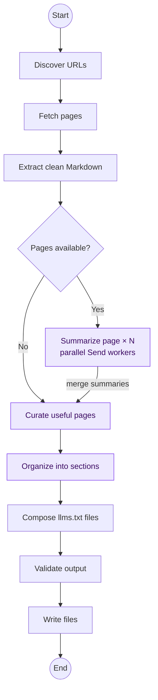

# auto-llm-txt

Generate a compact, spec-aligned `llms.txt` index (and an optional curated
`llms-full.txt`) for any website with LangGraph.

- Sitemap-first, representative sampling, BFS fallback; same-path-prefix scope
- HTML → clean markdown via `trafilatura` (fallback: BeautifulSoup)
- LLM summarization + curation + categorization (parallel via LangGraph **Send API**)
- llms.txt v2-aligned renderer and validator — [llmstxt.org](https://llmstxt.org)

## Agent workflow



When pages are available, LangGraph fans them out to parallel summary workers.
Their results are merged through the state reducer before curation continues.
Without an API key, the same graph uses deterministic fallback heuristics for
the LLM-assisted nodes highlighted above.

## Quick start

```bash
uv sync
cp .env.example .env   # set OPENROUTER_API_KEY
uv run auto-llm-txt https://docs.example.com/ -o ./out
cat out/llms.txt
```

Run `uv run auto-llm-txt --help` for all options, including crawl limits,
model selection, preview control, and opting out of `llms-full.txt` generation.
Add `--verbose` to print discovered URLs and each page summary while the
progress display runs.

Without `OPENROUTER_API_KEY`, LLM steps use scaffold heuristics so the graph still runs.

The generated files are deployment artifacts. Publish `llms.txt` at the root of
the site or covered subpath, and publish `llms-full.txt` beside it when enabled.
Source links remain authoritative site URLs; the curated full file supplies a
clean Markdown context fallback for sites that do not expose per-page Markdown.

## LangGraph Studio

```bash
uv run auto-llm-txt-studio
```

This starts the local LangGraph development server with hot reload and opens
Studio in your browser. Studio options are forwarded directly, for example:

```bash
uv run auto-llm-txt-studio --port 8000 --no-browser
```

## Project structure

```
src/auto_llm_txt/
├── agent.py          # graph wiring + compilation
├── config.py         # pydantic-settings from .env
├── constants.py
├── state.py          # SiteState TypedDict + pydantic schemas
├── prompts.py
├── nodes/            # discover, fetch, extract, summarize, curate, categorize, compose, validate, write
│   ├── routing.py    # fan_out_summaries (Send API)
│   └── utils.py
└── tools/            # crawler, fetcher, extractor, renderer (pure & unit-testable)
main.py               # thin CLI entry
langgraph.json
```
